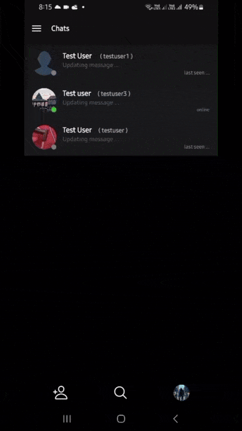

# AI ChatWave app Overview
An AI-powered real-time chat application for Android users, designed to make communication social, engaging, and fun! Inspired by Instagram Stories, ChatWave offers features like AI-assisted messaging, stickers/GIFs sharing, and more.

[Download apk](https://github.com/Akshat2512/ChatWave/releases/download/v1.0-preview/AI-Chatwave-preview-version.apk)

## Features
- **Account**: Users can easily create and login their personal accounts.
<p align="center">
&nbsp&nbsp&nbsp

<br>
</p>

- **Real time updates**: Allows Real-time messaging and profile synchronization. Any updates to user details, such as name or profile image, are instantly reflected for connected users. User can see their friends online in real time and the time they last active.

<p align="center">

<br>
</p>

- **Gif/Sticker Sharing**: Allows users to enhance their conversations by sharing GIFs or stickers effortlessly using a drag-and-drop interface. In gif search, user can add gifs in their Favourite section on long press on them or stickers. 

https://github.com/user-attachments/assets/710047a8-c0a6-48e4-a92d-70afd47f623c

- **AI Chat Recommendations**: Integrates an advanced AI model that assists with conversations by analyzing user communication styles and personas.
<p align="center">

</p>

- **Font Styling**: Enables users to change font styles.
<p align="center">

</p>

- **Change Themes**: User can switch between light and dark theme.
<p align="center">

</p>


## Tech Stack 🛠️
### Backend
- **Python FastAPI**: Framework for handling multiple user requests efficiently and manage multiple websocket connections on server side.
- **Websocket**: To handle Real Time messaging between users with robust server-client synchronization.

### Frontend
- **React Native or Expo Dev**: Frameworks for developing android, ios or web application
- **EAS Cli**: Continuous Integration and Continuous Delivery for creating production-ready application.

### Services
- **AI Integration**: Integrated TogetherAI's meta-llama/Llama-3.3-70B-Instruct-Turbo-Free model for AI assisted chat recommendation, ensuring conversational relevance and coherence.
- **Git/GitHub**: Utilized for version control, enabling efficient tracking of code changes, and supporting Continuous Integration/Deployment (CI/CD).
- **Giphy API service**: Utilized the Giphy API to retrieve public GIF URLs based on user input. This integration enhances user engagement by enabling users to search for specific GIFs, stickers, or emojis and share them seamlessly with their friends through API integration
- **Azure Web Service**: Hosted backend using Azure's Free SKU instance for CI/CD and public accessibility. Only allows 5 concurrent websocket connection at a time due to limited resource usage.
- **PostgreSQL Service (via Vercel)**: For maintaining data integrity and securely stores user-related data, including credentials and messages.

Below diagram shows how WebSocket server manages real-time, bidirectional communication between connected users, ensuring seamless message delivery via specific WebSocket URLs.

<p align="center">
<br>
</p>

The image below demonstrates the database structure

<p align="center">
<br>
</p>


## Key Responsibilities and Achievements

### Design and Development
- Designed both architecture of the application, ensuring real time messaging and AI integration.
- Developed the front-end using frameworks like react native, expo dev, creating an intuitive and user-friendly interface.

### Backend Management
- Managed and optimized the backend processes to handle real-time user interactions efficiently.
- Used FastAPI to handle realtime messaging.
- Implemented chat memory management feature until instance is running. 
- Ensured smooth communication between the UI and the AI models, reducing latency and improving performance.

### Memory Retention
 Implemented a chat memory management chat conversations are managed both on server side using psql database and on client side using redux persists.

## Impact
- Improved UI/UX design, making the application user-friendly.

This is an [Expo](https://expo.dev) project created with [`create-expo-app`](https://www.npmjs.com/package/create-expo-app).

## Get started

1. Install dependencies

   ```bash
   npm install
   ```

2. Start the app

   ```bash
    npx expo start
   ```


In the output, you'll find options to open the app in a

- [development build](https://docs.expo.dev/develop/development-builds/introduction/)
- [Android emulator](https://docs.expo.dev/workflow/android-studio-emulator/)
- [iOS simulator](https://docs.expo.dev/workflow/ios-simulator/)
- [Expo Go](https://expo.dev/go), a limited sandbox for trying out app development with Expo

You can start developing by editing the files inside the **app** directory. This project uses [file-based routing](https://docs.expo.dev/router/introduction).

## Get a fresh project

When you're ready, run:

```bash
npm run reset-project
```

This command will move the starter code to the **app-example** directory and create a blank **app** directory where you can start developing.

## Learn more

To learn more about developing your project with Expo, look at the following resources:

- [Expo documentation](https://docs.expo.dev/): Learn fundamentals, or go into advanced topics with our [guides](https://docs.expo.dev/guides).
- [Learn Expo tutorial](https://docs.expo.dev/tutorial/introduction/): Follow a step-by-step tutorial where you'll create a project that runs on Android, iOS, and the web.

## Join the community

Join our community of developers creating universal apps.

- [Expo on GitHub](https://github.com/expo/expo): View our open source platform and contribute.
- [Discord community](https://chat.expo.dev): Chat with Expo users and ask questions.


