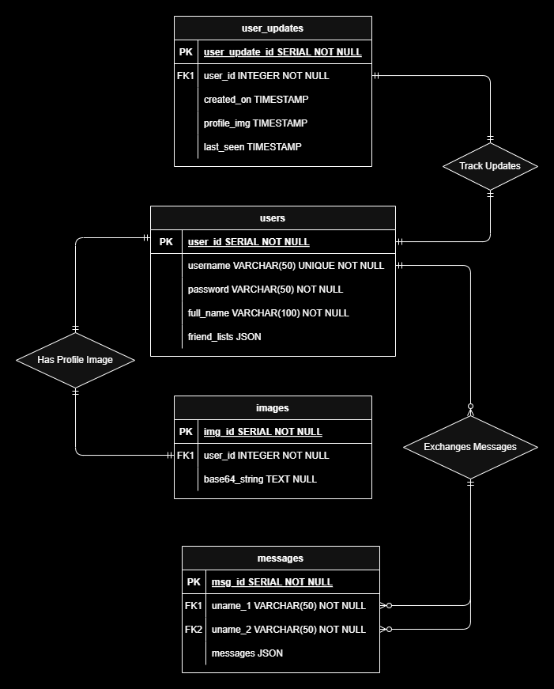

# AI ChatWave app Overview
An AI-powered real-time chat application for Android users, designed to make communication social, engaging, and fun! Inspired by Instagram Stories, ChatWave offers features like AI-assisted messaging, stickers/GIFs sharing, and more.

## Features
- **Account**: Users can easily create and login their personal accounts.
<p align="center">
&nbsp&nbsp&nbsp

<br>
</p>

- **Real time updates**: Real-time messaging and profile synchronization ensure instant reflections of changes (e.g., name or profile image) for connected users.

<p align="center">

<br>
</p>

- **Gif/Sticker Sharing**: User can share gifs or stickers using drag and drop.

https://github.com/user-attachments/assets/9bddcaf1-4f36-4d40-bb82-c6a2a0fb82e7

mAndY0y4

- **AI assists**: Used AI model for AI assisted conversation.
- **Friends/Connections**: User send friend requests to users.
- **Memory Retention Feature**: Implemented a chat memory management chat conversations are managed on both server side using database and on client side using redux persists.

-**Change Themes**: User can switch between light and dark Mode.


## Tech Stack 🛠️
### Backend
- **Python FastAPI**: Framework for handling multiple user requests efficiently and manage multiple websocket connections on server side.
- **Websocket**: To handle Real Time messaging between users with robust server-client synchronization.

### Frontend
- **React Native or Expo Dev**: Frameworks for developing android, ios or web application
- **EAS Cli**: Continuous Integration and Continuous Delivery for creating production-ready application.

### Services
- **AI Integration**: Integrated TogetherAI's meta-llama/Llama-3.3-70B-Instruct-Turbo-Free model for AI assisted chat recommendation, ensuring conversational relevance and coherence.
- **Git/GitHub**: Utilized for version control, enabling efficient tracking of code changes, and supporting Continuous Integration/Deployment (CI/CD).
- **Azure Web Service**: Hosted backend using Azure's Free SKU instance for CI/CD and public accessibility. Only allows 5 concurrent websocket connection at a time due to limited resource usage.
- **PostgreSQL Service (via Vercel)**: For maintaining data integrity and securely stores user-related data, including credentials and messages.

Below diagram shows how WebSocket server manages real-time, bidirectional communication between connected users, ensuring seamless message delivery via specific WebSocket URLs.

<p align="center">
<br>
</p>

The image below demonstrates the database structure

<p align="center">
<br>
</p>


<!-- <p align="center">
<br>
</p>
 <p align="center">
<br>
</p>
<p align="center">
<br>
</p>
<p align="center">
<br>
</p> -->

## Key Responsibilities and Achievements

### Design and Development
- Designed both architecture of the application, ensuring real time messaging and AI integration.
- Developed the front-end using frameworks like react native, expo dev, creating an intuitive and user-friendly interface.

### Backend Management
- Managed and optimized the backend processes to handle real-time user interactions efficiently.
- Used FastAPI to handle realtime messaging.
- Implemented chat memory management feature until instance is running. 
- Ensured smooth communication between the UI and the AI models, reducing latency and improving performance.

## Impact
- Improved UI/UX design, making the application user-friendly.

## Installation and Setup Instruction 🖥️
- ### Clone the Repository 
If you have a repository for your project, clone it using git: 
```bash
     git clone https://github.com/Akshat2512/AI_Chatwave.git 
     cd AI_Chatwave # move to the root folder of the application
```
Next, create a separate virtual environment for python dependencies
```bash
     python -m venv my_env &&
     my_env/Script/activate
```
Then install required libraries
```bash
     pip install -r requirements.txt
```

Then for starting application, first start the fastapi server i.e., app.py, run directly using this script in the terminal:
```bash
    uvicorn app:app --host localhost --port 5000 --reload
```

this, endpoint will accept all app requests Go to https://localhost:5000.

<!-- CREATE TABLE users (
    user_id SERIAL PRIMARY KEY,
    username VARCHAR(50) UNIQUE NOT NULL,
    password VARCHAR NOT NULL,
    full_name VARCHAR(100) NOT NULL,
    created_on TIMESTAMP,
    privacy VARCHAR(7),
    friend_lists JSON,
    group_ids JSON
);


CREATE TABLE user_updates (
    user_update_id SERIAL PRIMARY KEY,
    user_id INTEGER REFERENCES users(user_id) ON DELETE CASCADE,
    full_name TIMESTAMP ,
    profile_img TIMESTAMP ,
    last_seen TIMESTAMP,
    messages TIMESTAMP
);


CREATE TABLE messages (
    msg_id SERIAL PRIMARY KEY,
    uname_1 VARCHAR(50) NOT NULL REFERENCES users(username),
    uname_2 VARCHAR(50) NOT NULL REFERENCES users(username),
    messages JSON  
);

SET CLIENT_ENCODING TO 'UTF8';
<!-- SET client_encoding = 'UTF8'; -->

<!-- CREATE TABLE images (img_id SERIAL PRIMARY KEY, user_id INTEGER REFERENCES users(user_id) ON DELETE CASCADE, base64_string TEXT NULL);


ALTER SEQUENCE images_img_id_seq RESTART WITH 1001;
ALTER SEQUENCE messages_msg_id_seq RESTART WITH 1;
ALTER SEQUENCE users_user_id_seq RESTART WITH 101;
ALTER SEQUENCE user_updates_user_update_id_seq RESTART WITH 101;


SELECT pg_size_pretty(pg_total_relation_size('images')) AS total_size; --> 


 <!-- uvicorn app:app --host 0.0.0.0 --port 5000 --reload -->
